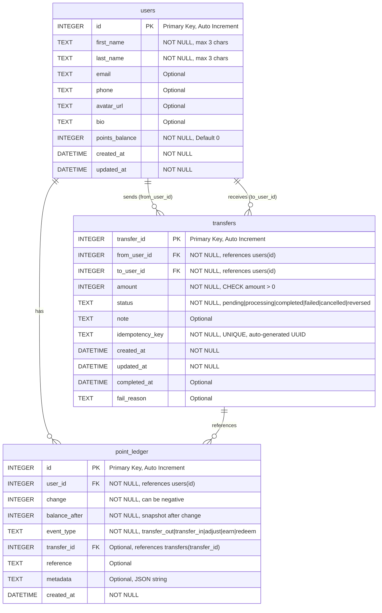

# Database Schema - AI Workshop Transfer API

## ER Diagram



## Tables Description

### 1. users
User account information with points balance.

**Key Fields:**
- `id`: Unique identifier (INTEGER PRIMARY KEY AUTOINCREMENT)
- `first_name`, `last_name`: Max 3 characters each (business rule)
- `points_balance`: Current available points (INTEGER, representing cents/points)

**Indexes:**
- `idx_users_email`: On email field for faster lookup

### 2. transfers
Point transfer transactions between users.

**Key Fields:**
- `transfer_id`: Unique identifier (INTEGER PRIMARY KEY AUTOINCREMENT)
- `from_user_id`, `to_user_id`: Source and destination users (FOREIGN KEY to users.id)
- `amount`: Transfer amount in points (INTEGER, must be > 0)
- `status`: Transaction status (CHECK constraint)
- `idempotency_key`: Auto-generated UUID to prevent duplicate transfers (UNIQUE)

**Business Rules:**
- Cannot transfer to the same recipient consecutively
- Must have sufficient balance
- Idempotency key ensures no duplicate transactions

**Indexes:**
- `idx_transfers_from`: On from_user_id for sender history
- `idx_transfers_to`: On to_user_id for receiver history
- `idx_transfers_created`: On created_at for chronological queries

### 3. point_ledger
Immutable audit log of all point changes.

**Key Fields:**
- `user_id`: User affected by the change (FOREIGN KEY to users.id)
- `change`: Amount changed (INTEGER, negative for deductions)
- `balance_after`: Balance snapshot after this change (INTEGER)
- `event_type`: Type of transaction (CHECK constraint)
- `transfer_id`: Links to transfer if applicable (FOREIGN KEY to transfers.transfer_id)

**Purpose:**
- Complete audit trail
- Balance reconciliation
- Transaction history

**Indexes:**
- `idx_ledger_user`: On user_id for user transaction history
- `idx_ledger_transfer`: On transfer_id for transfer-related entries
- `idx_ledger_created`: On created_at for time-based queries

## Relationships

1. **users → transfers (from_user_id)**
   - One user can send many transfers
   - Each transfer has exactly one sender

2. **users → transfers (to_user_id)**
   - One user can receive many transfers
   - Each transfer has exactly one receiver

3. **users → point_ledger**
   - One user has many ledger entries
   - Each entry belongs to exactly one user

4. **transfers → point_ledger**
   - One transfer creates multiple ledger entries (sender & receiver)
   - Each ledger entry may reference zero or one transfer

## Database Constraints

### Foreign Keys
```sql
FOREIGN KEY (from_user_id) REFERENCES users(id)
FOREIGN KEY (to_user_id) REFERENCES users(id)
FOREIGN KEY (user_id) REFERENCES users(id)
FOREIGN KEY (transfer_id) REFERENCES transfers(transfer_id)
```

### Check Constraints
```sql
CHECK (amount > 0)
CHECK (status IN ('pending','processing','completed','failed','cancelled','reversed'))
CHECK (event_type IN ('transfer_out','transfer_in','adjust','earn','redeem'))
```

### Unique Constraints
```sql
UNIQUE (idempotency_key)
```

## Data Types

- **INTEGER**: SQLite 64-bit signed integer
- **TEXT**: Variable-length UTF-8 string
- **DATETIME**: Stored as RFC3339 format, handled as `time.Time` in Go

## API Compliance

This schema follows the specifications from:
https://github.com/mikelopster/kbtg-ai-workshop-oct/blob/main/workshop-4/specs/transfer.yml

Key features:
- ✅ Auto-generated idempotency keys (UUID)
- ✅ Integer amounts (no decimals)
- ✅ Proper foreign key relationships
- ✅ Audit trail via point_ledger
- ✅ Transaction status tracking
- ✅ No consecutive same recipient transfers
