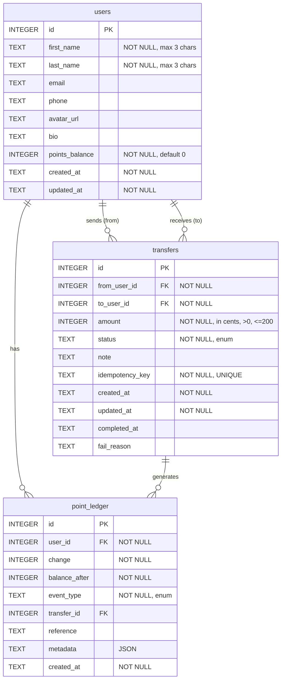

# Database Schema

## Business Rules

### Users
- `first_name` and `last_name` must not exceed 3 characters
- `points_balance` tracks user's current point balance (in cents)

### Transfers
- Maximum transfer amount: 2.00 (200 cents)
- Amount must have at most 2 decimal places
- Cannot transfer to the same recipient as the last completed transfer
- Status values: pending, processing, completed, failed, cancelled, reversed
- `idempotency_key` ensures duplicate prevention

### Point Ledger
- Append-only transaction log
- Event types: transfer_out, transfer_in, adjust, earn, redeem
- Each transfer creates two ledger entries (one for sender, one for receiver)
- `balance_after` provides audit trail of balance changes
