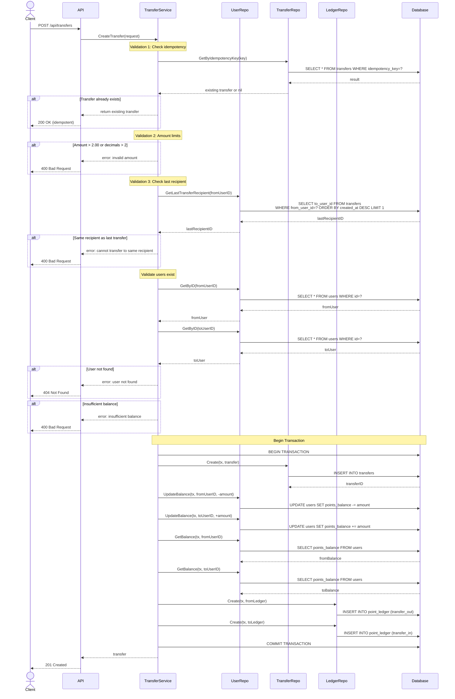
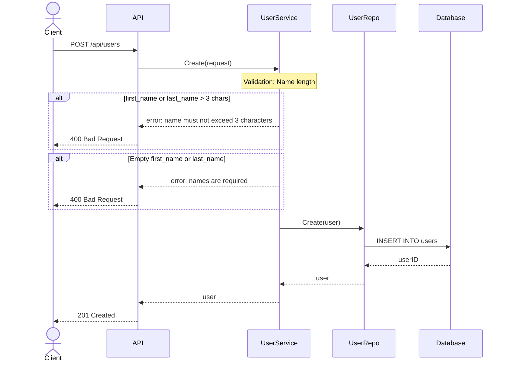
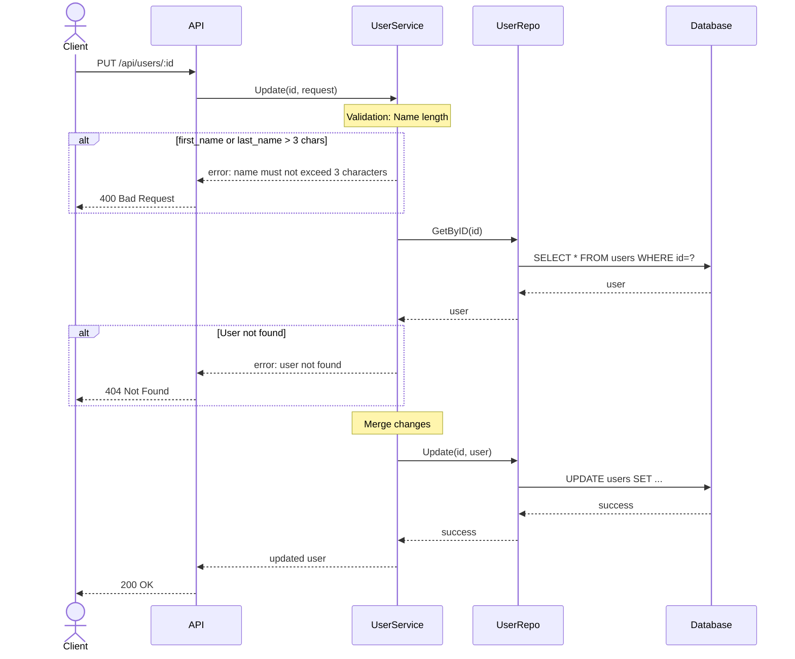

# Transfer API Sequence Diagram

## POST /api/transfers - Create Transfer



## Key Validation Points

### 1. Name Length Validation (Users)
- Checked in `UserService.Create()` and `UserService.Update()`
- Uses `utf8.RuneCountInString()` to count characters (not bytes)
- Returns error if first_name or last_name > 3 characters

### 2. Transfer Amount Validation
- Maximum: 2.00 (200 cents)
- Decimal places: at most 2
- Validation logic:
  ```go
  amountCents := math.Round(req.Amount * 100)
  if math.Abs(req.Amount*100 - amountCents) > 0.001 {
      return error // more than 2 decimals
  }
  if req.Amount > 2.0 {
      return error // exceeds max
  }
  ```

### 3. No Consecutive Same Recipient
- Query last completed transfer's recipient
- Compare with current transfer's recipient
- Block if they match
- Allow if transferring to a different user

## POST /api/users - Create User



## PUT /api/users/:id - Update User


